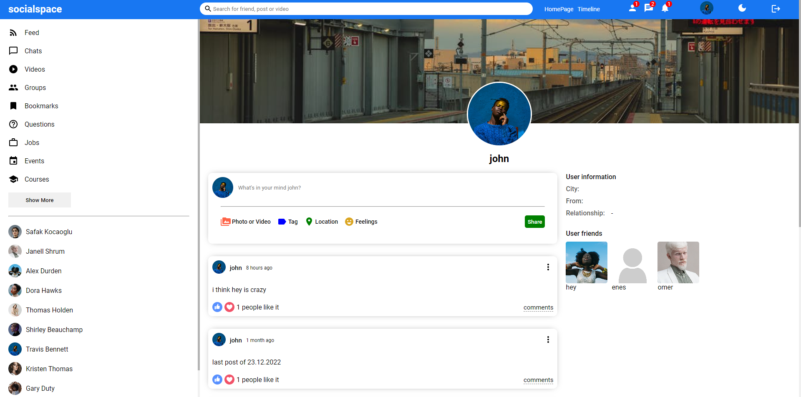

# Social Media App

This is a simple social media application named ***socialspace***. In this application,
- you can login, logout or create an account,
- you can share and like a post,
- you can follow or unfollow an user,
- you can change theme,
- you can see your posts and friends on your profile page,
- also you can see your friends' and your posts on your home page.

## Technologies which I used

- React.js
- Node.js
- Express.js
- REST API
- MongoDB

You can look over the server side of this app in [here](https://github.com/eneskaya12/social-media-app-api).

## Screenshots

> Home page of application in light & dark theme

> Profile page of application in light & dark theme

> Login & register pages of application

